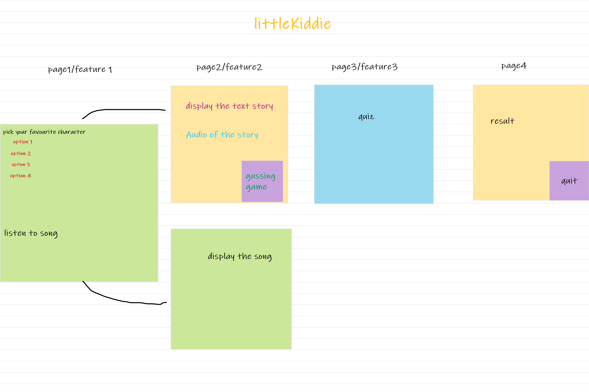
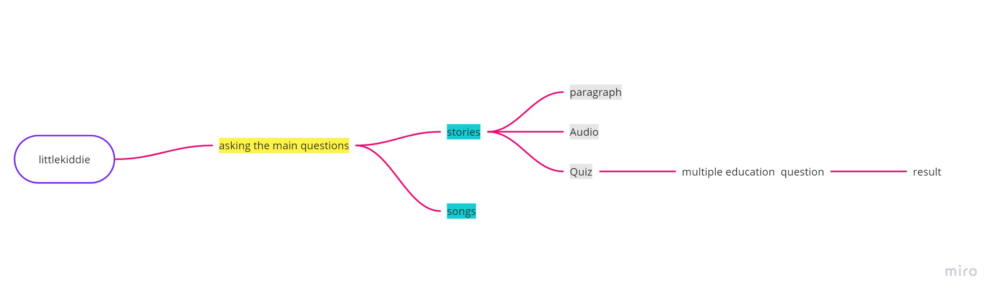

# Little_Kiddie
## Team members :
- Mais Abdelrazeq 
- Joudi Awameh 
- Sondos AL-Braim 
- Abdullah Mouazen
- Rand Al-Sallaq
## problem Domain 
### ‌Usually,‌ ‌children‌ ‌do‌ ‌not‌ ‌know‌ ‌what‌ ‌stories‌ ‌they‌ ‌want‌ ‌to‌ ‌read,‌ ‌they‌ ‌might‌ ‌get‌ ‌confused‌ ‌or‌ ‌they‌ ‌could‌ ‌not‌ ‌have‌ ‌any‌ ‌idea.‌
### Our program provides a couple of features that entertain kids such as stories and songs. In addition to that, it makes the process of choosing a story easier for them.

## wireframe

## User story
- As a user, I want to see two options; stories and songs
- The stories should be generated depending on some inputs. 
 - I would like to listen to these stories.
- A game should be included too
- I would like to listen to some songs as well
### The trello link 
[trello](https://trello.com/b/wnzi6I8r/littlekiddie)

## Domain Modeling
